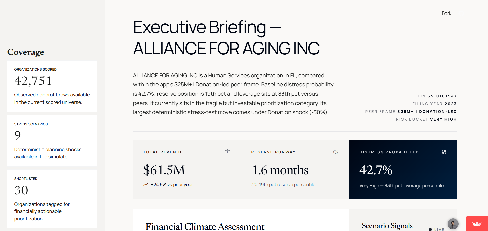
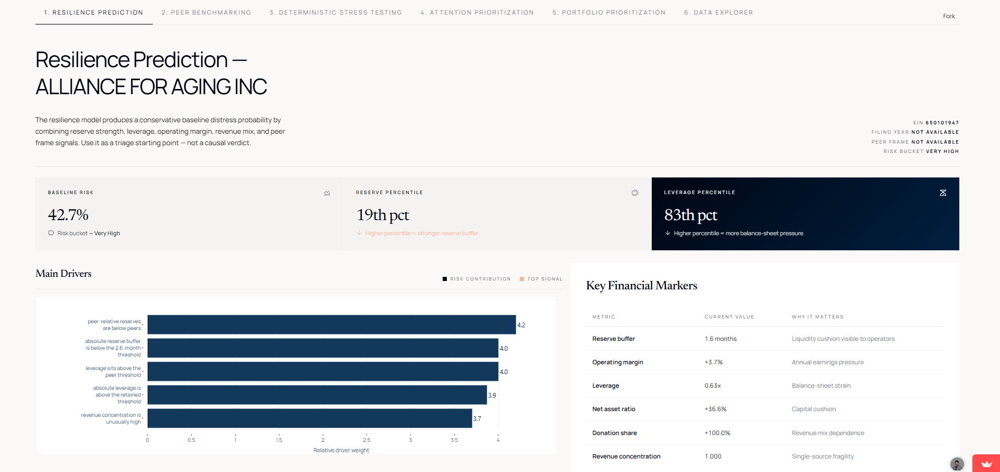
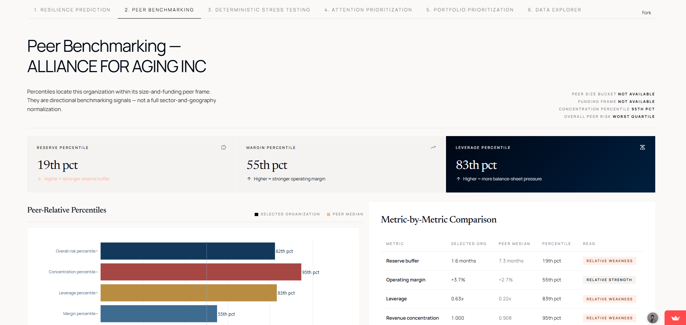
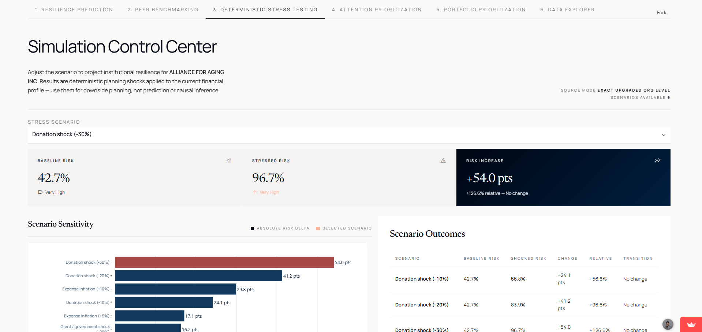
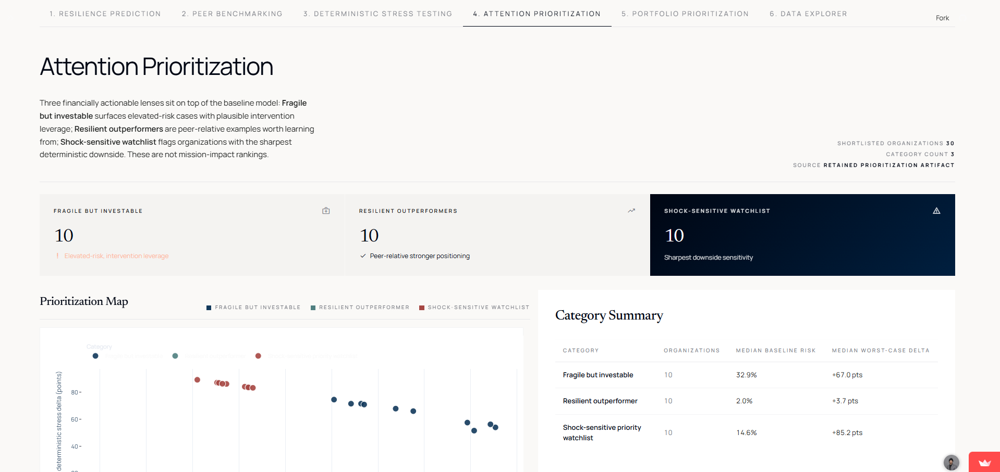

<h1 align="center">IRS Form 990 Nonprofit Financial Resilience & Distress Modeling</h1>

<p align="center">
  An analytics + ML project that turns public nonprofit filings into a practical workflow for financial risk screening,
  peer benchmarking, and deterministic stress testing.
</p>

<p align="center">
  <a href="https://nonprofit-shock-simulator-skyb3jbqtnsejlvq6a8vl3.streamlit.app/"><strong>Open the live Streamlit app</strong></a>
</p>

## Overview

This project uses IRS Form 990 filing data to answer a simple but important question: which nonprofits look financially resilient, which look financially fragile, and which deserve closer review before a funding or cost shock hits?

I built the repo as an end-to-end decision-support system, not just a model notebook. It starts from a panel of nonprofit filings, engineers finance-focused features, builds next-year distress proxy labels, benchmarks organizations against peers, runs deterministic stress scenarios, and surfaces the results in a Streamlit app that supports both org-level drilldown and portfolio-level triage.

## Why This Matters

- Public nonprofit data is broad, but it is hard to turn raw filings into fast, actionable financial signals.
- A single-year financial snapshot can miss the difference between "looks okay today" and "becomes fragile under stress."
- Review teams often need more than one output: a baseline risk signal, peer context, scenario sensitivity, and a shortlist of where attention may matter most.
- This project focuses on financial resilience and financial distress screening. It does not claim to measure mission outcomes or social impact directly.

## Live App

- Live Streamlit app: [https://nonprofit-shock-simulator-skyb3jbqtnsejlvq6a8vl3.streamlit.app/](https://nonprofit-shock-simulator-skyb3jbqtnsejlvq6a8vl3.streamlit.app/)
- The app is a decision-support layer on top of generated artifacts in the repo. It prefers the upgraded rerun in `new results/` and falls back to older packaged outputs only when needed.

## What The App Does

1. Lets you pick a nonprofit from the scored universe.
2. Shows a baseline distress probability, risk bucket, top financial drivers, and threshold flags.
3. Compares the organization with similar peers on reserves, margin, leverage, and revenue concentration.
4. Applies deterministic revenue and expense shocks to show how risk changes under pressure.
5. Surfaces shortlist-style action buckets such as fragile but investable, resilient outperformers, and shock-sensitive watchlists.
6. Adds portfolio ranking and data exploration views so the workflow can move from macro scanning to org-level explanation.

## Screenshots

### Executive Briefing

The landing view gives a fast portfolio-style read on the selected organization before drilling into the deeper tabs.



### Resilience Prediction

This view shows the retained baseline risk score, driver chart, and threshold logic in plain business terms.



### Peer Benchmarking

The peer view translates the model into relative positioning against comparable nonprofits, not just raw ratios.



### Deterministic Stress Testing

The shock simulator shows how baseline risk changes under revenue shocks and expense inflation scenarios.



### Attention Prioritization

The shortlist layer turns the analysis into triage buckets that support review, intervention, and monitoring.



## What This Project Demonstrates

- End-to-end analytics product work: raw public data, feature engineering, modeling, scenario analysis, packaging, and app delivery.
- Interpretable ML decision-making: the retained app backbone is a logistic model chosen for transparency even though stronger black-box challengers were tested.
- Panel data thinking under messy real-world conditions: continuity issues, repaired years, observed-vs-imputed handling, and next-year label construction.
- Product and UX judgment: portfolio ranking, org drilldown, peer context, plain-English explanations, and guardrails around overclaiming.
- Technical communication: the repo includes code, output tables, summary docs, a deck, and screenshots that all support the same core story.

Quick evidence from the repo:

- `irs990_cohort_features.csv`: 540,860 filing-year rows, 122,392 EINs, 71 columns, tax years 2017-2024.
- Core Form 990 observed-pair modeling panel: 145,852 rows.
- Latest scored 2023 universe used by the app: 42,751 organizations.
- Retained upgraded logistic model on the 2022 holdout: ROC-AUC `0.810`, PR-AUC `0.658`, Brier `0.121`.
- Deterministic scenario engine: 9 revenue/cost stress scenarios plus 30 shortlist rows across 3 action buckets.

## Technical Deep Dive

### Data Source And Panel Construction

The repo starts from a single source cohort file: `irs990_cohort_features.csv`. In the checked-in data, that file contains 540,860 filing-year rows across 122,392 EINs and spans tax years 2017 through 2024.

The cohort is already prebuilt when the repo begins. Based on the data and supporting docs, it represents organizations that ever fell into the `$1M-$80M` revenue cohort used for the project. Almost all rows are Form 990 filings (`540,404` rows), with only a thin Form 990-PF tail (`456` rows). The main modeling scripts read this single cohort file and build everything downstream from it.

For the core predictive panel, the repo does not train on every row indiscriminately. It constructs consecutive-year pairs, then restricts the main modeling dataset to observed current-year and next-year filings. In the checked-in outputs, `distress_outputs/intermediate/modeling_panel_observed_pairs.csv` contains 145,925 observed pairs overall, including 145,852 Form 990 rows that power the primary modeling story.

One important repo nuance: there are two generations of downstream outputs.

- `distress_outputs/`: the original backbone and packaged output set.
- `new results/`: the later upgraded rerun that the Streamlit app prefers.

That split matters because the live app is wired to the upgraded artifacts first, while older packaged files remain in the repo as fallback evidence.

### Form 990 Context

Form 990 is a public annual filing for U.S. tax-exempt organizations. It is rich enough to support financial screening, but it is still filing data rather than ground-truth operating telemetry.

In this repo, Form 990 is used to capture:

- revenue, expenses, and surplus/deficit structure
- net assets, assets, and liabilities
- fundraising and grantmaking expense signals
- revenue mix across donations, program revenue, investment income, and other sources
- lightweight organizational context such as employees, age, state, and peer bucket

That makes the repo well suited for financial resilience analysis. It does not make it a direct measure of mission effectiveness, service quality, or social impact.

### Missingness And Continuity Issues

The panel is not clean enough to treat every year the same way. The provided cohort includes explicit `observed_flag` and `imputed` columns, and roughly `32.3%` of rows in the source file are flagged as imputed.

The biggest continuity issue is tax year 2020. In the checked-in cohort, the 2020 slice has 72,854 rows but only 1,303 observed filings, meaning about `98.2%` of that year is imputed. The repo's supporting note `Denton_Method_Approach.docx` explains the upstream continuity repair as a Denton-style, peer-group-based reconstruction meant to preserve movement patterns while respecting observed anchors.

The current modeling code stays conservative around that repaired panel:

- core labels require consecutive next-year pairs
- the main predictive panel uses observed current-year and next-year rows
- the upgraded rerun focuses on reliable feature years `2017`, `2018`, `2021`, and `2022`
- imputed rows remain flagged instead of being silently treated as fully trusted observations

That distinction is important: the repo uses repaired panel data as context, but the main predictive backbone is not trained as if all repaired rows were equally reliable.

### Feature Engineering Logic

The baseline feature engineering lives in `scripts/build_distress_pipeline.py`. It rebuilds safer financial ratios from raw filing fields, clips unstable values, and adds peer-relative context.

Core feature families include:

- reserve / liquidity: `reserve_months_proxy`
- operating health: `operating_margin_clean`
- leverage / solvency: `liability_ratio_clean`, `net_asset_ratio_clean`
- trajectory: `revenue_growth_clean`, `expense_growth_clean`, `expense_growth_gap`, `asset_growth_clean`
- funding structure: `donation_share_clean`, `program_share_clean`, `investment_share_clean`, `grants_share_clean`
- concentration: `revenue_hhi_clean`
- size and scale: log revenue, expenses, assets, employees, and organization age
- peer-relative features: within-peer percentiles and gaps

Examples of the repo's feature logic:

- `reserve_months_proxy` is built as positive net assets times 12 divided by expenses, then clipped to `0-36` months.
- `liability_ratio_clean` is rebuilt from liabilities over assets and clipped to `0-3`.
- `revenue_hhi_clean` is computed from squared revenue-source shares to capture concentration risk.
- peer metrics are calculated within the same `tax_year`, `return_type_clean`, and `peer_group`.

The upgraded rerun in `scripts/build_selective_upgrade_results.py` goes further. It adds:

- `log_net_asset_coverage`
- observed-only peer percentiles
- peer residual and z-score features
- one-year coverage change in log space

It also deliberately removes direct current-year margin and reserve levels from the retained predictive feature set. That cleanup makes the score easier to defend alongside the app's thresholds and shortlist logic because the model is less circularly tied to the exact same current-year thresholds being surfaced in the UI.

### Peer Benchmarking Logic

Peer benchmarking is not a loose "compare to everyone" layer. It is explicit and rule-based in the code.

The peer denominator is:

- same fiscal year
- same return type
- same `peer_group`

`peer_group` itself is a 15-cell taxonomy built from size bucket by funding model. In plain terms, the repo benchmarks an organization against similarly sized nonprofits with a similar revenue model.

The benchmark cards compute percentiles and peer-median gaps for:

- reserve buffer
- operating margin
- leverage
- revenue concentration
- model risk

Then the packaging layer turns those into readable strength and weakness flags, such as bottom-quartile reserves or top-quartile leverage pressure.

There is also optional sector enrichment through an IRS Business Master File join. That enrichment improves context, but it is not the primary peer denominator. In the packaged output summary, broad sector coverage is about `71%` of the scored 2023 universe, so sector should be treated as helpful context rather than a perfect matching key.

### Financial Distress And Resilience Modeling Approach

The repo contains both an original and an upgraded modeling pass.

The original backbone in `scripts/build_distress_pipeline.py` evaluates several next-year distress proxy labels and retains `composite_distress`, a multi-signal rule that marks next-year strain when at least two adverse conditions occur, such as weak margin, low reserves, high leverage, revenue decline, or asset decline.

The upgraded pass in `scripts/build_selective_upgrade_results.py` changes the framing from mostly absolute thresholds to a more peer-aware label: `peer_relative_composite`. In that upgraded label, next-year distress is flagged when multiple peer-relative weakness or deterioration signals show up, or when balance-sheet failure pairs with weak peer-relative margin.

That means the repo is not predicting bankruptcy or closure directly. It is predicting a next-year financial distress proxy built from filing-based symptoms.

Model-wise, the repo tests both interpretable and stronger black-box options:

- retained app backbone: `upgraded_logistic`
- tested challengers: `lightgbm`, `catboost`, and `catboost_lightgbm_blend`

The upgraded logistic is kept on purpose. On the 2022 holdout, the checked-in scorecard shows:

- `upgraded_logistic`: ROC-AUC `0.8098`, PR-AUC `0.6581`, Brier `0.1211`
- `catboost_lightgbm_blend`: ROC-AUC `0.8637`, PR-AUC `0.7257`, Brier `0.1074`

The repo still keeps logistic as the deployed story backbone because:

- coefficients are easier to explain
- thresholds are easier to translate into action
- app messaging stays more defensible for business review

Risk buckets in the app are driven by explicit cutoffs:

- `Low`: `<= 0.10`
- `Watch`: `0.10-0.20`
- `High`: `0.20-0.35`
- `Very High`: `> 0.35`

### Stress Testing Logic

The shock engine is deterministic and accounting-based. It is designed to answer "what happens if this nonprofit takes a funding or cost hit?" rather than "what will definitely happen next year?"

The repo defines 9 scenarios across 4 families:

- donation shocks: `-10%`, `-20%`, `-30%`
- program revenue shocks: `-10%`, `-20%`
- grant / government shocks: `-10%`, `-20%`
- expense inflation shocks: `+5%`, `+10%`

For each scenario, the package code recomputes key financial features, including:

- operating margin
- reserve months
- leverage
- net asset ratio
- revenue growth
- expense growth gap
- asset growth
- donation share
- revenue concentration

Then it re-scores the same retained model on the shocked feature set and records:

- shocked risk
- absolute and relative risk increase
- risk-bucket transition
- driver text such as reserve depletion, leverage pressure, revenue concentration, or margin compression

Important assumptions in the repo:

- liabilities are held constant during the shock pass
- peer group is held fixed
- revenue shocks flow directly through current-year revenue and net assets
- expense inflation flows directly through current-year expenses and net assets
- donor versus grant exposure is approximated because Form 990 combines contributions and grants in the same filing line

In the upgraded 2023 scored universe, the top average scenario in `new results/shock_scenario_summary.csv` is `expense_inflation_10`, with an average absolute risk increase of about `0.032`.

### How Insights Are Surfaced In Streamlit

The app in `app.py` is not a retraining pipeline. It is a presentation and decision-support layer on precomputed artifacts.

The data loader in `streamlit_demo/data_loader.py` resolves files in a priority order so the app uses the upgraded rerun when available:

- upgraded run summary from `new results/`
- upgraded peer cards and shortlists from `new results/`
- exact upgraded org-level shock rows from `streamlit_demo_data/`
- fallback packaged outputs from `distress_outputs/` only when necessary

The app currently exposes six tabs:

1. `Resilience Prediction`
2. `Peer Benchmarking`
3. `Deterministic Stress Testing`
4. `Attention Prioritization`
5. `Portfolio Prioritization`
6. `Data Explorer`

Those tabs turn stored model outputs into analyst-friendly views:

- baseline risk score and risk bucket
- driver chart and threshold chips
- benchmark table and peer narrative
- scenario comparison and worst-case sensitivity
- shortlist tables and watchlists
- portfolio rankings by risk, peer weakness, or scenario sensitivity

Some of the app's narrative text is generated heuristically from saved benchmark and shock fields rather than from local explainability tooling such as SHAP. That is a product choice visible in the code, and it is worth stating explicitly for technical reviewers.

## Repository Structure

```text
.
|-- app.py
|-- requirements.txt
|-- irs990_cohort_features.csv
|-- screenshots/
|-- scripts/
|   |-- build_distress_pipeline.py
|   |-- build_fairlight_package.py
|   |-- build_selective_upgrade_results.py
|   `-- build_streamlit_demo_artifacts.py
|-- streamlit_demo/
|   |-- data_loader.py
|   |-- logic.py
|   |-- portfolio_rankings.py
|   `-- ui.py
|-- streamlit_demo_data/
|   |-- upgraded_shock_simulation_results.csv
|   |-- upgraded_shock_scenario_summary.csv
|   `-- streamlit_demo_artifacts.json
|-- distress_outputs/
|   |-- intermediate/
|   `-- fairlight_package/
|-- new results/
|-- submission_ready/
|-- README_streamlit_demo.md
|-- data_contract_streamlit.md
|-- demo_walkthrough.md
|-- repo_vomit_doc.md
|-- Denton_Method_Approach.docx
|-- Regression_Modeling.docx
|-- Peer_Benchmarking.docx
|-- Shock_Simulation.docx
`-- 16-04-2026 - AggieHack - HouseOfTockens.pptx
```

Key folders and files:

- `scripts/`: modeling, packaging, upgraded rerun, and demo-artifact rebuild logic
- `new results/`: upgraded retained logistic outputs that the live app prefers
- `distress_outputs/`: original backbone outputs and packaged benchmark/shock artifacts
- `streamlit_demo/`: app data loading, logic, rankings, and UI helpers
- `streamlit_demo_data/`: exact upgraded org-level shock artifacts used by the app
- `submission_ready/`: trimmed review bundle for presentation and handoff
- supporting docs and deck files: methodology notes, output summaries, and the presentation narrative

## How To Run Locally

The repo can be run locally as a Streamlit app from the checked-in artifacts.

1. Install the lightweight app dependencies:

```bash
python -m pip install -r requirements.txt
```

2. Start the app:

```bash
streamlit run app.py
```

Notes:

- The committed app dependencies are intentionally lightweight: `streamlit`, `plotly`, `pandas`, and `numpy`.
- The app expects generated CSV/JSON artifacts that are already present in the repo, including files under `new results/`, `distress_outputs/`, and `streamlit_demo_data/`.
- If you want to rebuild the exact upgraded org-level shock artifact, the repo includes `scripts/build_streamlit_demo_artifacts.py`, but that step depends on the broader modeling stack beyond the lightweight `requirements.txt`.

## Key Limitations And Guardrails

- This is a financial distress proxy system, not a direct bankruptcy, closure, or mission-impact model.
- The target is a next-year filing-based distress label, not an observed ground-truth failure event.
- The scenario engine is deterministic scenario analysis, not a causal forecast.
- Form 990 combines contributions and grants, so donor-versus-grant exposure is estimated heuristically in the shock engine.
- Peer matching is strongest on size and funding model. Sector and geography add context, but they are not the main peer denominator in the retained logic.
- The repo includes both an original output generation and a later upgraded rerun. The app prefers the upgraded rerun, but reviewers should know both generations exist.
- The source cohort includes imputed continuity-repair rows. The main predictive panel handles that conservatively, but the repo still inherits the limits of the upstream repaired dataset.
- The analysis is about financial resilience. It should not be presented as a direct measure of nonprofit social value or program impact.
